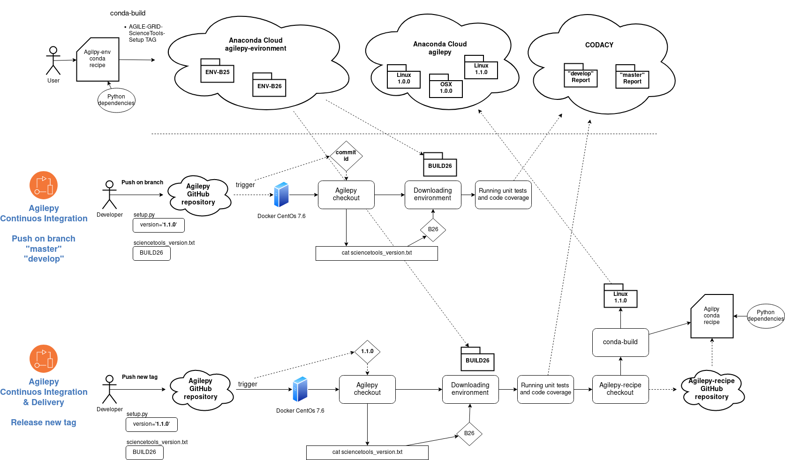

***********
Development
***********

Install the development environment with Docker
===============================================

If you want to develop new Agilepy features or try the newest yet unreleased ones,
a development Docker image called agilepy-recipe is availabe on DockerHub.
It contains all the dependencies but Agilepy, which must be manually installed by cloning the repository.

Agilepy's development containers can be found at dockerhub `agilescience/agilepy-recipe <https://hub.docker.com/repository/docker/agilescience/agilepy-recipe>`_ page,
please check it for the latest tag.

Instructions
------------

1. Pull the development Docker image, replace :code:`<LATEST-TAG>` with the
latest tag available at `agilepy-recipe/tags <https://hub.docker.com/r/agilescience/agilepy-recipe/tags>`_.

.. code-block::

    export LATEST_TAG=BUILD25b6-v2
    docker pull agilescience/agilepy-recipe:$LATEST_TAG

2. Prepare your workspace by creating a directory :code:`agilepy_development`
and store its path in a variable :code:`$PATH_TO_AGILE`.
The :code:`agilepy_development` directory is going to be shared between your local file system tree and the developement container's one.

.. code-block::

    mkdir agilepy_development && cd agilepy_development

3. Clone the GitHub Agilepy repository, switch to the development branch you are interested to work on
(e.g. :code:`develop` or any other branch with a given feature).

.. code-block::

    git clone https://github.com/AGILESCIENCE/Agilepy.git && cd Agilepy && git switch develop && cd ..

4. Execute the `boostrap_dev.sh` script to change the user inside the container to your local user.

.. code-block::

    ./Agilepy/agilepy/scripts/bootstrap_dev.sh $LATEST_TAG
    export IMAGE_NAME="${LATEST_TAG}_$(whoami)"
    export CONTAINER_NAME="agilepy_dev_$(whoami)"
    export CONTAINER_JUPYTER_PORT=8090

5. Create a Docker container with name :code:`$CONTAINER_NAME` from the Docker image.

.. code-block::

    docker run --rm -t -d -p $CONTAINER_JUPYTER_PORT:8888 --name $CONTAINER_NAME -e DISPLAY=$DISPLAY -v /tmp/.X11-unix:/tmp/.X11-unix:rw -v $(pwd):/home/flareadvocate/agile agilescience/agilepy-recipe:$IMAGE_NAME

    a. The command above shares the :code:`agilepy_development` directory between host and container.
    b. Mount any additional volumes you need to share with the container with the :code:`-v` option.
    c. The command above binds port :code:`8888` of the container to port :code:`$CONTAINER_JUPYTER_PORT` of your local host, change it if already in use.
    d. If you are working in a remote machine, add the :code:`--no-browser` option.
    e. If you have problem with the network connection, add the :code:`--network=host` option.

6. Enter the container with:

.. code-block::

    docker exec -it $CONTAINER_NAME bash -l

7. Inside the container move to the repository location and install Agilepy's Python dependencies and Agilepy in *editable* mode:

.. code-block::

    cd $HOME/agilepy_development/Agilepy
    python3 -m pip install -r requirements.lock
    python3 -m pip install -e .

Now you have the Agilepy's latest development version installed in your environment.
You can also edit it to implement your own agilepy features!

8. The documentation can be built with:

.. code-block::

    cd $HOME/agile/Agilepy/docs
    make html

9. If you need to start a Jupyter server run the following command:

::

    nohup jupyter notebook --ip="*" --port 8888 --notebook-dir="$HOME/agilepy_development/Agilepy/agilepy/notebooks" > jupyter_notebook_start.log 2>&1 &

    
    a. The notebook will be available at `localhost:8090 <http://localhost:8090>`_
    b. If the remote machine needs authentication you can set an ssh tunnel with: :code:`ssh -N -f -L localhost:8090:localhost:8090 <user>@<remote_machine>`
    c. You can obtain the Jupter access token with: `docker exec -it $CONTAINER_NAME bash -c "jupyter notebook list"` (outside the container)
    d. You can disable the authentication with :code:`--NotebookApp.token='' --NotebookApp.password=''` but it is not recommended.

10. The unit tests can be started with the following command:

::

    start_coverage.sh

11. When you need to exit the container just enter :code:`exit`.

12. To stop the container use

.. code-block::

    docker stop $CONTAINER_NAME

Example of development deployment
=================================
`This document <https://docs.google.com/document/d/1HSmHy6FeoKIlG9SX0YU8fuJSROswhCg3xsC94mgvnLo/edit>`_ describes an example of development deployment of Agilepy on agilehost3. 

Docker images
=============
To build the docker image of Agilepy clone the [Agilepy-recipe repository](https://github.com/AGILESCIENCE/Agilepy-recipe)

Git flow
========

Branches
--------

Two main branches:

* **master**: contains only production releases.
* **develop**: contains commits that will be included in the next production release.

Two support branches:

* **feature** branch: each new feature (Trello's card) should be developed in its own feature branch, branching from **develop** and merged back into it. The **feature** branch are not pushed into the remote.
* **hotfix** branch: if an hotfix is needed it should be develop in its own branch, branching from **master** and merged back to it.

.. image:: static/gitflow.jpg
  :width: 600
  :alt: Git flow

Versioning
----------
The **master** branch contains only production releases: when the **develop** branch (or **hotfix** branch) is merged
to **master** a new release tag must be created. Its name follows the `semantic versioning <https://semver.org/>`_.

    x.y.z

Incrementing:

* x version when you make incompatible API changes,
* y version when you add functionality in a backwards compatible manner, and
* z version when you make backwards compatible bug fixes.

Branches names
--------------

The **master** and the **develop** branch have an infinite lifetime, hence their name is fixed.

The **feature** branch takes the following format:

    feature-#<card-number>-<short-description>

e.g. feature-#61-new-cool-feature

The **hotfix** branch name takes the following format:

    hotfix-#<card-number>-<release-number>

e.g. hotfix-#57-1.0.0

The release number is the one of the production release from which it originates from.

Getting started
---------------

Development of a new feature
^^^^^^^^^^^^^^^^^^^^^^^^^^^^

Create a new **feature** branch:
::

    git checkout develop 
    git pull origin develop
    git checkout -b feature-#61-new-cool-feature develop

Development and testing of the new feature.

When you have finished, update the CHANGELOG.md and commit your changes.

::

    vim CHANGELOG
    git commit -m "feature-#61-new-cool-feature done"

In the meantime it is possible that someone else have pushed his work into the develop branch. In this case
you have to merge the changes in your feature branch.

::

    git pull **origin** develop

Finally, you can open a merge request to merge your feature branch back to the **develop** branch.

Add configuration parameters
^^^^^^^^^^^^^^^^^^^^^^^^^^^^

Let's say we want to add the following configuration section to the AGAnalysis' configuration file.

::
    
    ap:
        radius: 0.25
        timeslot: 3600

* Add the new section to the AGAnalysis.getConfiguration() method.
* Add the type of the configuration parameters within the AGAnalysisConfig.checkOptionsType() method (in the corresponding lists).
* If the parameters need some kind of validation (this is not the case), add a new method in ValidationStrategies and call it within the AGAnalysisConfig.validateConfiguration() (check examples).
* If the parameters need some kind of transformation (this is not the case), add a new method in CompletionStrategies and call it within the AGAnalysisConfig.completeConfiguration() (check examples).
* Add the new configuration section to all the unit test configuration files. 
* Document the new configuration parameters within the manual/configuration_file.rst file. 

Add a new science tool
^^^^^^^^^^^^^^^^^^^^^^

Let's say we want to add a new (c++) science tool: AG_ap.

* Add a new class within the api/ScienceTools.py script. You need to implement some abstract methods.
* You can use the new class as follows: 

:: 

    apTool = AP("AG_ap", self.logger)
    apTool.configureTool(self.config)
    if not apTool.allRequiredOptionsSet(self.config):
        raise ScienceToolInputArgMissing("Some options have not been set.")
    products = apTool.call()

Release of a new version
^^^^^^^^^^^^^^^^^^^^^^^^

Change the version of the software in setup.py. The version increment must be take
in account all the commits of the **develop** branch. You can check the CHANGELOG.md
to facilitate this process. Please, add the new tag within the CHANGELOG.md file.

::

    git checkout master
    git merge --no-ff develop
    git tag -a <new-tag>
    git push origin <new-tag>

DevOps
======

A high level description of agilepy's devops is in the image below: 

This scheme workflow produces three images:

* **base_image**: It's an image with all the dependencies except Agilepy python library, it's used for developing purposes only by developers. Base image is built after a new commit in agilepy-recipe repository.

* **latest code image**: It's the base_image with Agilepy's develop branch at latest commit, useful for using or testing agilepy's updates not officially released. This image is not supported nor stable and is built by dockerhub after github's testing pipelines are successful.

* **released image**: The base_image with Agilepy's release tag. By default the community shall be download this image. It's built when a new tag is created.

