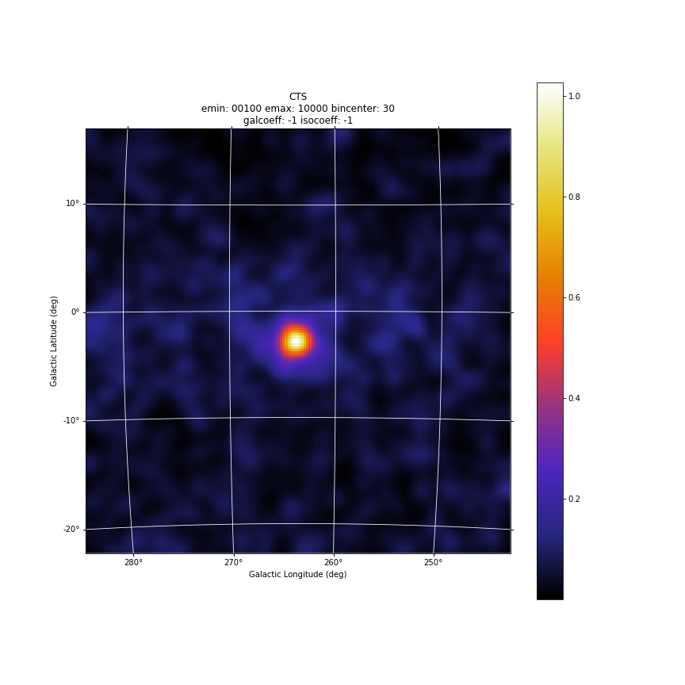
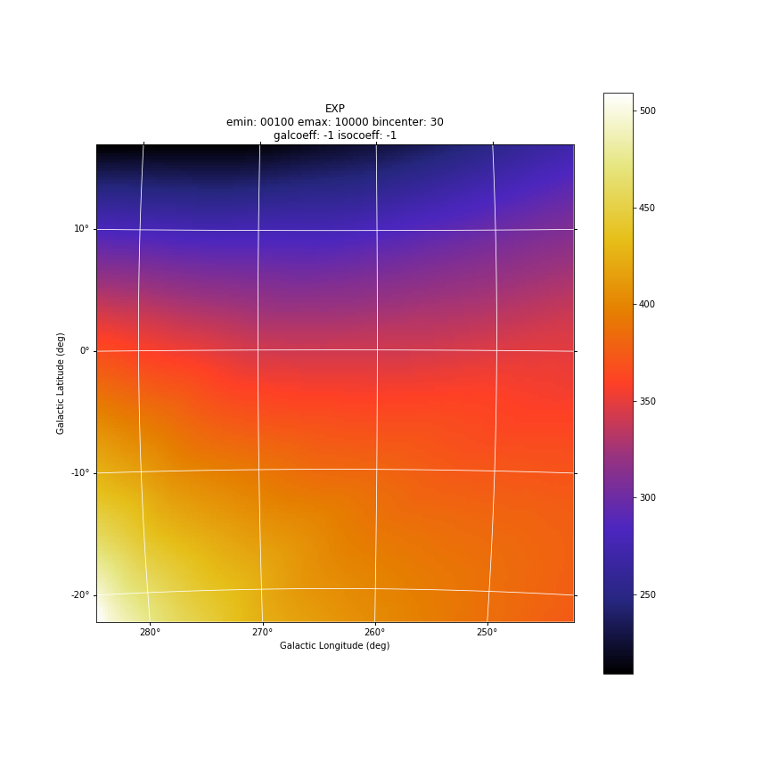
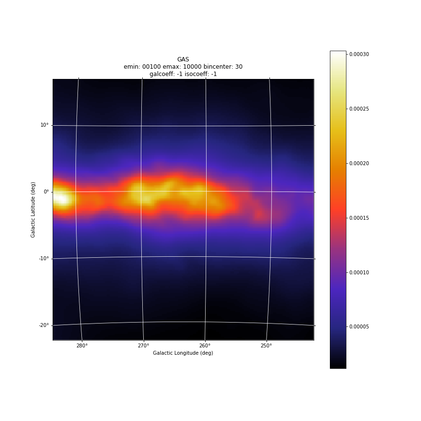
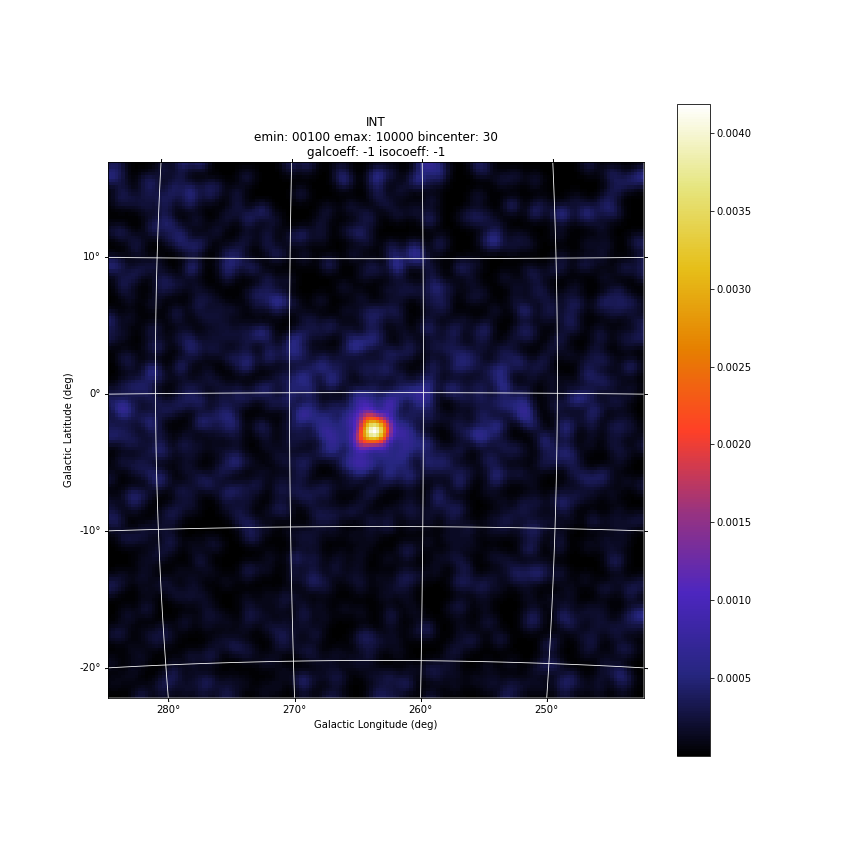

********
Products
********

Sky maps
========

'*.cts.gz*' file
^^^^^^^^^^^^^^^^
Counts maps are generated by the procedure AG_ctsmapgen embedded into Agilpy.

AG_ctsmapgen reads the event files listed in the event file index (see "AGILE data" section), bins the counts between tmin
and tmax, and outputs a FITS image file. The image is a two-dimensional array in the ARC or
AIT projection. The projection, size and resolution, the center and rotation of the map in Galactic coordinates, tmin, tmax, emin, and emax, along with various integration parameters (fovrad, fovradmin, albrad, phasecode) are managed by Agilepy. 

The parameters are described in the "Configuration file" section.

'*.exp.gz*' file
^^^^^^^^^^^^^^^^
Exposure maps are generated by the procedure AG_expmapgen embedded into Agilpy. 

The task AG_expmapgen reads the log files listed in the LOG index (see "AGILE data" section), integrates the exposure between tmin and tmax, and outputs a FITS exposure image file. The
image is a two-dimensional array in either the ARC or AIT projection. The projection, size and
resolution, and center and rotation of the map in Galactic coordinates, tmin, tmax, emin,
emax, and index file are managed by Agilepy, along with various integration parameters (fovrad, albrad, y tol, roll tol, earth tol, phasecode), and an interpolation step size (binstep).
The interpolation procedure is a linear interpolation method in which only one bin each N
is calculated (where N is the step size parameter). For a bin size of 0.5 deg or 0.25 deg with a
step size of N = 4 it is possible to get a good approximation of the exposure map.

The parameters are described in the "Configuration file" section.

'*.gas.gz*' file
^^^^^^^^^^^^^^^^
Diffuse emission maps are generated by the procedure AG_gasmapgen embedded into Agilpy. AG_gasmapgen reads an exposure map produced by AG_expmapgen and the master diffuse emission map and outputs a FITS image file, in the same format as the
exposure map, in which each pixel contains the diffuse emission in that pixel. The image is a
square array in the ARC projection.
The diffuse emission map
contain models of the diffuse emission convolved with the energy-dependent point spread function and combined into predefined observed energy ranges according to the appropriate energy
dispersion function for G events using the FM3.119 background filter.
The diffuse emission map automatically selected by Agilepy based on the energy range of the analysis; e.g. if the
analysis is performed between 100 MeV and 50 GeV, Agilepy select the file 100_50000.0.1.SFMG_H0025.conv.sky.gz. 
The first number in the file name is the minimum energy and the second number is the maximum energy, followed by the resolution of the maps (0.1), the background event rejection filter (FM3.119) and the instrument response functions (IRFs).

'*.int.gz*' file
^^^^^^^^^^^^^^^^
Intensity maps are generated by the procedure AG_intmapgen embedded into Agilepy. AG_intmapgen reads an exposure map produced by AG_expmapgen
and a counts map produced by AG_ctsmapgen and outputs a FITS image file, in the same format as the counts map, in which each pixel contains the intensity in that pixel. The image is
a square array in the ARC projection. The two input maps should have been produced using
the same set of parameters. The intensity map is not used in scientific analysis; it is useful
solely as a visualization tool.

Result of the Maximum Likelihood Estimator
===========================================

Agilepy shows a high-level view of the results of the maximum likelihood estimator. See `this link <work_with_sources.html#the-multi-description-of-a-source-object>`_ for more details.

The details of the output of the science tool AG_multi that performs the likelihood procedure is still accessible. `This section <../sciencetools/mle.html>`_ describe the output of the AG_multi science tool, that performs a Maximum Likelyhood Estimator analysis to find the best position, flux and spectral parameters of a list of sources  given set of count maps.

Confidence Contour files
^^^^^^^^^^^^^^^^^^^^^^^^^

If a confidence contour was found, the parameters on the following line describe the best-fit ellipse of the contour, described in detail below. 

If source location was requested for a given source and a source location contour was found, then three additional files are generated for that source. These files are written using galactic coordinates in degrees and can be loaded by applications such as ds9 and overlaid on the maps provided as input to AG_multi to visualize the source location contours. One of the three files, with extension .con, contains the source contour as found by the ROOT functions, expressed as a list of galactic coordinates, one point per line, where the last line is a repetition of the first. It may depict any shape. The other two files describe the ellipse that best fits the contour. One has extension .ellipse.con and represents the ellipse as a contour in a format analogous to that of the .con file. The other has extension .reg and describes same ellipse by its axes and orientation. 

Determination of the ellipse. If AG_multi was able to find a source contour, an ellipse is fit to the contour. The source contour is a list of points which defines a polygon by connecting each point sequentially. The value of Radius found in the HTML output is the radius in degrees of a circle with the same area as the polygon. AG_multi determines the ellipse which best fits the contour. This ellipse will have the same area as the polygon, and the distance between each contour point and the intersection between the ellipse and the line connecting that point to the centre will be minimized. The ellipse is completely described by three parameters: the two axes and the rotation (in degrees) of the first axis around the centre, as expected by the ds9 application. If the ellipse is a circle, its axes will both be equal to the Radius found in the HTML output. The ellipse is described by two files that are readable by ds9: one is a .reg file which contains the centre, the axes and the rotation of the ellipse, while the other describes the same ellipse as a list of points in galactic coordinates, thus using the same syntax of a contour file, and has extension .ellipse.con. This is an example of ellipse .reg file:

ExpRatio
^^^^^^^^
Owing to the non-homogeneous sky coverage of the AGILE observations, it is possible that sources lie near the borders of certain pointings. In order to have an unbiased estimate of the coeffcients of the Galactic diffuse emission and isotropic background that could lead to to an incorrect evaluation of the flux and position of the source, exposure uniformity within the region of the analysis is required.
We applied a specific check to verify the uniformity of the exposure within the 10-degree radius of the AGILE MLE analysis centred at each source candidate position, over the considered timescale. The fraction of pixels of the exposure map within the region of analysis having a value below a pre-defined threshold was calculated, and if it was more than 10% the region was considered unreliable and the candidate was discarded. The exposure threshold value is evaluated by calculating the mean exposure of the observation over the full FoV area and comparing this exposure with the values of some reference good exposures.

The parameters expratioevaluation, expratio_minthr, expratio_maxthr, expratio_size described `here <configuration_file.html>`_.

Light curves
============
AGILE-GRID light curves can be created in two different ways:

* using a maximum likelihood estimator analysis 
* using aperture photometry. 

The likelihood analysis reach better sensitivity, more accurate flux measurement, better evaluation of the backgrounds and can work with a detailed source models where more sources can be considered at the same time. 

Aperture photometry provides a raw measure of the flux of a sigle source and is less computing demanding.

The likelihood light curve file contains the results of the generation of a light curve. The columns described are the following sections.

Time of the analysis in MJD:

* time_start_mjd: time start (MJD)
* time_end_mjd: time end (MJD)

Result of the analysis of the single source:

* sqrt(ts): the square root of the Test Statistic value of the results of the maximum likelihood estimator (mle)
* flux (ph/cm2/s/sr)
* flux_err (ph/cm2/s/sr)
* flux_ul (ph/cm2/s/sr)
* gal: the value of the galactic diffuse emission (gal) parameter
* gal_error: the error of the galactic diffuse emission (gal) parameter
* iso: the value of the isotropic emission (iso) parameter
* iso_error: the error of the isotropic emission (iso) parameter
* (l_peak, b_peak): position in Galactic coordinate (l_peak, b_peak): peak coordinates. If it is allowed to vary then they are set to the position for which the TS is maximized.
* dist_peak: distance between current l_peak, b_peak and previous position
* (l, b): position in Galactic coordinate evaluated by mle with the determination of the 95% confidence level elliptical confidence region
* r: radius of 95% c.l. circular confidence region, deg. Statistical error only
* ell_dist: the distance between (l,b) and the initial position
* a: the semimajer axis of the elliptical confidence region
* b: the semiminor axis of the elliptical confidence region
* phi: rotation of the elliptical confidence region
* exposure
* ExpRatio: see above section
* counts 
* counts_err 
* Index 
* Index_Err 
* Par2 
* Par2_Err 
* Par3 
* Par3_Err 
* Erglog 
* Erglog_Err 
* Erglog_UL 

Time of the analysis in UTC and TT:

* time_start_utc 
* time_end_utc 
* time_start_tt 
* time_end_tt 

The following are the initial parameters of the analysis of the source:

* Fix: initial fixflag 
* index: initial spectral index 
* ULConfidenceLevel 
* SrcLocConfLevel 
* start_l: initial Galactic coordinate l 
* start_b: initial Galactic coordinate b  
* start_flux: inital flux for the MLKE 
* typefun: type of spectral model 
* par2: initial value of par2 
* par3: initial value of par3 

The following are the parameters of the MLE analysis:

* galmode2 
* galmode2fit 
* isomode2 
* isomode2fit 
* edpcor 
* fluxcor 
* integratortype 
* expratioEval 
* expratio_minthr 
* expratio_maxthr 
* expratio_size 

Parameters of the maps:

* Emin 
* emax 
* fovmin 
* fovmax 
* albedo 
* binsize 
* expstep 
* phasecode 

Technical results of the fitting:

* fit_cts 
* fit_fitstatus0 
* fit_fcn0 
* fit_edm0 
* fit_nvpar0 
* fit_nparx0 
* fit_iter0 
* fit_fitstatus1 
* fit_fcn1 
* fit_edm1 
* fit_nvpar1 
* fit_nparx1 
* fit_iter1 
* fit_Likelihood1

::

    time_start_mjd time_end_mjd sqrt(ts) flux flux_err flux_ul gal gal_error iso iso_error l_peak b_peak dist_peak l b r ell_dist a b phi exposure ExpRatio counts counts_err Index Index_Err Par2 Par2_Err Par3 Par3_Err Erglog Erglog_Err Erglog_UL time_start_utc time_end_utc time_start_tt time_end_tt Fix index ULConfidenceLevel SrcLocConfLevel start_l start_b start_flux typefun par2 par3 galmode2 galmode2fit isomode2 isomode2fit edpcor fluxcor integratortype expratioEval expratio_minthr expratio_maxthr expratio_size Emin emax fovmin fovmax albedo binsize expstep phasecode fit_cts fit_fitstatus0 fit_fcn0 fit_edm0 fit_nvpar0 fit_nparx0 fit_iter0 fit_fitstatus1 fit_fcn1 fit_edm1 fit_nvpar1 fit_nparx1 fit_iter1 fit_Likelihood1
    58026.49921296296 58027.49921296296 7.3538 944.812e-08 213.193e-08 1419.5e-08 0.7,0.7 0,0 4.08416,3.84041 0,0 263.638 -2.85605 0 -1 -1 -1 -1 -1 -1 -1 3718660.0 1.99923 35.1344 7.92794 1.71345 0 3913.06 0 1.34774 0 1.67967e-09 3.7901e-10 2.52355e-09 2017-09-30T11:58:52.000 2017-10-01T11:58:52.000 433857532.0 433943932.0 1 1.71345 2 5.99147 263.638 -2.85605 8.98066e-06 2 3913.06 1.34774 0 0 0 0 0.75 0 1 1 0 15 10 100,300 300,1000 0,0 60,60 80 0.4 0 6 92 -1 344.873 0.5 0 52 3 0 317.834 5.85172e-17 1 52 3 404.289
    58027.49921296296 58028.49921296296 8.87831 1055.24e-08 211.709e-08 1524.18e-08 0.7,0.7 0,0 4.08416,3.84041 0,0 263.638 -2.85605 0 -1 -1 -1 -1 -1 -1 -1 3843970.0 3.11419 40.5633 8.13802 1.71345 0 3913.06 0 1.34774 0 1.87599e-09 3.76372e-10 2.70965e-09 2017-10-01T11:58:52.000 2017-10-02T11:58:52.000 433943932.0 434030332.0 1 1.71345 2 5.99147 263.638 -2.85605 8.98066e-06 2 3913.06 1.34774 0 0 0 0 0.75 0 1 1 0 15 10 100,300 300,1000 0,0 60,60 80 0.4 0 6 91 -1 341.314 0.5 0 52 3 0 301.902 5.88891e-17 1 52 3 391.515
    58028.49921296296 58029.49921296296 7.31495 820.826e-08 198.261e-08 1266.82e-08 0.7,0.7 0,0 4.08416,3.84041 0,0 263.638 -2.85605 0 -1 -1 -1 -1 -1 -1 -1 3788250.0 1.99923 31.095 7.51063 1.71345 0 3913.06 0 1.34774 0 1.45925e-09 3.52464e-10 2.25212e-09 2017-10-02T11:58:52.000 2017-10-03T11:58:52.000 434030332.0 434116732.0 1 1.71345 2 5.99147 263.638 -2.85605 8.98066e-06 2 3913.06 1.34774 0 0 0 0 0.75 0 1 1 0 15 10 100,300 300,1000 0,0 60,60 80 0.4 0 6 96 -1 357.958 0.5 0 52 3 0 331.204 1.01185e-16 1 52 3 423.045
    58029.49921296296 58030.49921296296 6.78978 840.67e-08 208.19e-08 1307.27e-08 0.7,0.7 0,0 4.08416,3.84041 0,0 263.638 -2.85605 0 -1 -1 -1 -1 -1 -1 -1 3806190.0 3.11419 31.9975 7.92411 1.71345 0 3913.06 0 1.34774 0 1.49452e-09 3.70116e-10 2.32404e-09 2017-10-03T11:58:52.000 2017-10-04T11:58:52.000 434116732.0 434203132.0 1 1.71345 2 5.99147 263.638 -2.85605 8.98066e-06 2 3913.06 1.34774 0 0 0 0 0.75 0 1 1 0 15 10 100,300 300,1000 0,0 60,60 80 0.4 0 6 110 -1 404.846 0.5 0 52 3 0 381.795 1.35163e-15 1 52 3 486.25
    58030.49921296296 58031.49921296296 7.63221 820.4e-08 190.928e-08 1249.81e-08 0.7,0.7 0,0 4.08416,3.84041 0,0 263.638 -2.85605 0 -1 -1 -1 -1 -1 -1 -1 3793810.0 2.9604 31.1244 7.24344 1.71345 0 3913.06 0 1.34774 0 1.45849e-09 3.39428e-10 2.22189e-09 2017-10-04T11:58:52.000 2017-10-05T11:58:52.000 434203132.0 434289532.0 1 1.71345 2 5.99147 263.638 -2.85605 8.98066e-06 2 3913.06 1.34774 0 0 0 0 0.75 0 1 1 0 15 10 100,300 300,1000 0,0 60,60 80 0.4 0 6 97 -1 365.286 0.5 0 52 3 0 336.161 1.10047e-16 1 52 3 426.229

