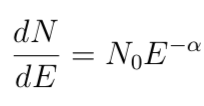
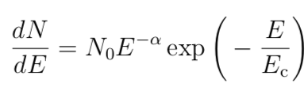
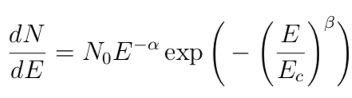
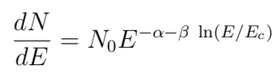

.. _sources-file:

************
Sources file
************

The sources can be defined using one of two different formats: xml document and text file.

The flux parameter estimates are relevant in the fitting process, as the sources
are considered one by one starting with the one with the brightest initial flux
value, regardless of the order they are given in the source file.

Spectral models
========================
A full energy band spectral fit of the data is performed with different spectral model. The spectral representations used in the BUILD25 are PL, exponential cut-off PL, super-exponential cut-off PL, and log parabola (LP). More details are reported in https://arxiv.org/abs/1903.06957

The PL spectral model is used for all sources that are not significantly curved and have low exposure, 

where N0 is the prefactor and alpha is the index explicitly evaluated by the MLE method. Our MLE spectral fitting does not explicitly output the prefactor value, which is internally calculated by the numerical procedure.
The majority of the AGILE sources are described by a PL.

The exponential cut-off PL spectral model (PC) is

where N0 is the prefactor, α is the index, and Ec is the cut-off energy. The values Ec and α are explicitly provided by the MLE method.

The super exponential cut-off PL spectral model (PS) is

where N0 is the prefactor, α is the first index, β the second index, and Ec is the cut-off energy. The parameters α, Ec, and β are explicitly provided by the MLE method.

The LP spectral model is

where N0 is the prefactor, Ec is the pivot energy, α is the first index, β the curvature. The parameters α, Ec, and β are explicitly provided by the MLE method.

The selection of curved spectra followed the acceptance criteria described in bulgarelli19. Briefly, a source is considered significantly curved if T Scurved > 16, where T Scurved = 2 × (log L(curved spectrum)−log L(power law), where L is the likelihood function obtained changing only the spectral representation of that source and refitting all free parameters.

Source library format (xml document)
====================================

.. code-block:: xml

  <?xml version="1.0" ?>
  <source_library title="source library">

    <!-- Point Sources -->
    <source name="2AGLJ2202+4214" type="PointSource">
      <spectrum type="PowerLaw">
        <parameter name="flux" free="1"  value="7.45398e-08"/>
        <parameter name="index" free="1" scale="-1.0" value="1.96903" min="0.5" max="5"/>
      </spectrum>
      <spatialModel type="PointSource" location_limit="0">
        <parameter name="pos" value="(92.4102, -10.3946)" free="0" />
      </spatialModel>
    </source>

    <source name="2AGLJ0007+7308" type="PointSource">
      <spectrum type="PLExpCutoff">
         <parameter name="flux" free="1"  value="41.6072e-08"/>
         <parameter name="index" free="1" scale="-1.0" value="1.29082" min="0.5" max="5"/>
         <parameter name="cutoffEnergy" free="1" scale="-1.0" value="2003.9" min="20" max="10000"/>
      </spectrum>
      <spatialModel type="PointSource" location_limit="0">
         <parameter name="pos" value="(119.677, 10.544)" free="0" />
      </spatialModel>
    </source>

    <source name="2AGLJ0835-4514" type="PointSource">
      <spectrum type="PLSuperExpCutoff">
        <parameter name="flux" free="1"  value="969.539e-08"/>
        <parameter name="index1" free="1" scale="-1.0" value="1.71345" min="0.5" max="5"/>
        <parameter name="cutoffEnergy" free="1" value="3913.06" min="20" max="10000"/>
        <parameter name="index2" free="1" value="1.3477" min="0"  max="100"/>
      </spectrum>
      <spatialModel type="PointSource" location_limit="0">
        <parameter name="pos" value="(263.585, -2.84083)" free="0" />
      </spatialModel>
    </source>

    <source name="2AGLJ1801-2334" type="PointSource">
      <spectrum type="LogParabola">
        <parameter name="flux" free="1"  value="35.79e-08"/>
        <parameter name="index" free="1" scale="-1.0" value="3.37991" min="1" max="4"/>
        <parameter name="pivotEnergy" free="1" scale="-1.0" value="2935.07" min="500" max="3000"/>
        <parameter name="curvature" free="1" scale="-1.0" value="0.682363" min="0.1" max="3"/>
      </spectrum>
      <spatialModel type="PointSource" location_limit="0">
        <parameter name="pos" value="(6.16978, -0.0676943)" free="1" />
      </spatialModel>
    </source>

  </source_library>

AGILE format (text file)
========================
The source list is a text file listing at least one source. Each line of text describes one source and it is possible to include empty lines or comment lines. The comment lines begin with an exclamation mark. 

Each source is described by a line containing space separated values, in the following order:

::

   'flux' 'l' 'b' 'spectral index' 'fixflag' 'minSqrt(TS)' 'name' 'locationlimit' 'funtype' 'par2' 'par3' 'index limit min' 'index limit max' 'par2 limit min' 'par2 limit max' 'par3 limit min' 'par3 limit max'

The '*flux*' parameter is expressed in cm^-2 s^-1, galactic longitude '*l* 'and latitude '*b*' are expressed in degrees.

The spectral index of each source represents the initial estimates of the values for that source (a positive number). The other spectral parameters depends by the spectral shape of the source.

minSqrt(TS) is the minimum acceptable value for the square root of TS: if the optimized significance of a source lies below this value, the source is considered undetected and will be ignored (set to flux = 0) when considering the other sources.

After the name of the source (which should not contain a space), an optional value for the location limitation in degrees may be provided. If this value is present and not zero, the longitude and latitude of the source will not be allowed to vary by more than this value from its initial position.

According to the fixflag some or all of those values will be optimized by being allowed to vary. 

The fixflag parameter
---------------------

According to the '*fixflag*' some or all of those values will be optimized by being allowed to vary.
The fixflag is a bit mask, each bit indicating whether the corresponding value is to be allowed to vary:

| fixflag = 0 everything is fixed (free=”0”)
| fixflag = 1 indicates the flux (free=”1” in <parameter name="Flux">)
| fixflag = 2 the position is free (free=”1” in <spatialModel type="PointSource">)
| fixflag = 4 the Index or Index1 is free (free=”1” in <parameter name="Index"> or <parameter name="Index1"> )
| fixflag = 8 the par2 is free (free=”1” in <parameter name="CutoffEnergy"> or <parameter name="PivotEnergy">)
| fixflag = 16 the par3 is free (free=”1” in <parameter name="Index2"> or <parameter name="Curvature">)
| fixflag = 32 force position to be variable only in Loop2 (free=”2” in <spatialModel type="PointSource">)

The user may combine these values, but the flux will always be allowed to vary if at least one of the other values are.

.. csv-table::
   :header: " ", "flux", "pos(free=1)", "Index/Index1", "cutoff/pivot", "Index2/Curvature", "pos(free=2)"
   :widths: 20, 20, 20, 20, 20, 20, 20

   fixflag, 1, 2, 4, 8, 16, 32

| Examples:
| fixflag = 0: everything is fixed. This is for known sources which must be included in order to search for other nearby sources.
| fixflag = 1: flux variable, position fixed
| fixflag = 2: only the position is variable, but AG_multi will let the flux vary too, so this is equivalent to 3.
| fixflag = 3: flux and position variable, index fixed
| fixflag = 4: index variable (and flux variable)
| fixflag = 5: flux and Index variable, position fixed
| fixflag = 7: flux, position and Index variable and also
| fixflag = 28: Index, par2 and par3 variable (and flux variable)
| fixflag = 30: position, Index, par2 and par3 variable (and flux variable)
| fixflag = 32: position=2, the rest is fixed

The funtype parameter
---------------------

SM: Spectral model. PL indicates power-law fit to the energy spectrum; PC indicates power-law with exponential cutoff fit to the energy spectrum; PS indicates power-law with su- per exponential cut-off fit to the energy spectrum; LP indicates log-parabola fit to the energy spectrum

| 0) "PL", "PowerLaw", "x^(-[index])"
| 1) "PC", "PLExpCutoff", "x^(-[index]) * e^(- x / [par2])"
| 2) "PS", "PLSuperExpCutoff", "x^(-[index]) * e^(- pow(x / [par2], [par3]))"
| 3) "LP", "LogParabola", "( x / [par2] ) ^ ( -( [index] + [par3] * log ( x / [par2] ) ) )"

The match of the parameteres is:

- Index=α: Spectral index for PL, PC, and PS spectral models, first index for LP spectral model, in the energy range 100 MeV – 10 GeV;
- ∆α: Statistical 1σ uncertainty of α, in the energy range 100 MeV – 10 GeV
- par2 = Ec (MeV): Cut-off energy for PC and PS spectral models, pivot energy for LP spectral model, in the energy range 100 MeV – 10 GeV;
- ∆Ec (MeV): Statistical 1σ uncertainty of Ec, in the energy range 100 MeV – 10 GeV
- par3 = β: Second index for PS spectral models, curvature for LP spectral model, in the energy range 100 MeV – 10 GeV
- ∆β: Statistical 1σ uncertainty of β, in the energy range 100 MeV – 10 GeV
